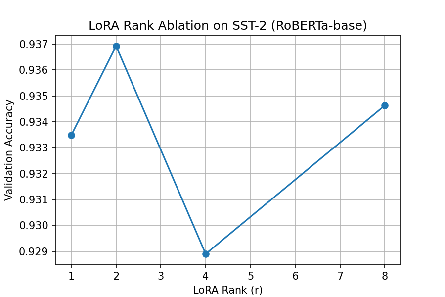

# LoRA (Low Rank Adaptation) Re-implementation

This project re-implements LoRA (Hu et al., 2021) paper from scratch.
I demonstrate that low-rank adaptation achieves comparable performance with 95% fewer parameters to train.


## Repo Directory structure 

```csharp
LoRA-from-scratch/
├── lora/
│   ├── lora_linear.py
│   ├── patch_roberta.py
│   ├── patch_gpt2.py
├── experiments/
│   ├── train_roberta.py
│   ├── train_gpt2.py
├── results/
│   ├── plots.ipynb
├── README.md
```


## Injecting LoRALinear into RoBERTa

As per the paper, the best trade-off to apply LoRA is on the $W_q$ and $W_v$ matrices.

Let's look at the overview of HUggingFace RoBERTa's Anatomy

```yaml
RobertaModel
 └── encoder
     └── layer[i]
         └── attention
             └── self
                 ├── query : nn.Linear
                 ├── key   : nn.Linear
                 ├── value : nn.Linear
```

We only going to touch: 
- `layer.attention.self.query`
- `layer.attention.self.value`

Rest of the matrices update doesn't add up much into performance in downstream task adaptation.

---

## LoRA on RoBERTa-base (SSt-2) Training

- Total Params : 124793088
- Trainable Params : 147456 (0.12%)
- Ranks (r) : 4
- Alpha (α) : 16
- Sequence Length: 64
- AMP enabled


| Epoch | Train Loss | Val Accuracy |
|------|-----------|--------------|
| 1 | 0.2850 | 93.12% |
| 2 | 0.2162 | 93.00% |
| 3 | 0.1985 | 92.66% |

LoRA weights (A, B) and classifier head are saved and reusable.


---


## Rank Ablation Study (LoRA on SST-2)

To analyze the effect of LoRA rank \( r \) on downstream performance, I conduct a rank
ablation study following the methodology discussed in Section 7.2 of the LoRA paper.

The goal is to evaluate whether task-specific adaptation saturates at low rank, which would
support the **low intrinsic dimension** hypothesis.

<p align="center">
  
</p>

### Experimental Setup
- Base model: RoBERTa-base
- Task: SST-2 (GLUE)
- LoRA applied to: $W_q$  and $W_v$
- Ranks evaluated: $r$ $\in$ ${1, 2, 4, 8\}$
- α = 16, epochs = 3
- Sequence length = 64, AMP enabled
- Only LoRA parameters (A, B) and the classifier head are trainable

### Results

| Rank (r) | Validation Accuracy |
|---------|---------------------|
| 1 | 93.35% |
| 2 | **93.69%** |
| 4 | 92.89% |
| 8 | 93.46% |

### Observation

- Even very small ranks (r = 1, 2) achieve strong performance.
- Increasing rank beyond r ≈ 2–4 does not yield consistent improvements.
- Performance remains within a narrow band (~0.9% absolute) across all ranks.

The slight non-monotonic behavior is expected on small datasets such as SST-2 and can be
attributed to training variance and noise rather than insufficient model capacity.

Overall, these results indicate that effective task adaptation can be achieved using
**low-rank updates**, consistent with the LoRA paper’s claim that most task-relevant updates
lie in a low-dimensional subspace.
